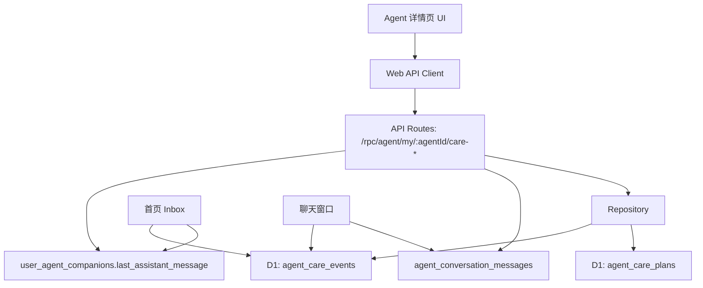

# Agent 主动关怀系统：让 AI 电子伴侣从“被动回复”走向“主动陪伴”

AI 电子伴侣如果永远只在用户发消息之后才回复，本质上还是一个聊天工具。真正的伴侣感，来自它能在合适的时刻主动出现：早安、晚安、久未聊天后的轻轻问候、压力期的一句陪伴、关系升温时的自然靠近。

这篇文章整理这次“主动关怀系统”的实现思路和落地细节。当前版本是 MVP，不直接做定时推送，而是先打通核心闭环：

```txt
配置主动关怀计划
-> 手动生成一条关怀消息
-> 写入真实聊天历史
-> 首页聊天列表显示最新消息和未读状态
-> 用户打开聊天后标记已读
```

这个闭环打通之后，后续接 Cloudflare Cron、站内通知、浏览器通知或 LLM 润色，都是在已有模型上继续扩展。

## 一、功能边界

当前版本实现了这些能力：

1. 每个用户的每个 Agent 都可以拥有一份主动关怀计划。
2. 支持配置是否开启、频率、偏好时间、关怀场景、语气强度、自定义关怀文案。
3. 支持在 Agent 详情页手动生成一条主动关怀消息。
4. 生成的消息会作为 assistant 消息写入 `agent_conversation_messages`。
5. 同步写入 `agent_care_events`，用于记录主动关怀事件和未读状态。
6. 首页 Agent 列表会把主动关怀消息作为最新回复展示。
7. 用户打开聊天窗口后，未读关怀事件会自动标记为已读。

暂时没有做这些：

1. 自动定时生成。
2. 浏览器通知。
3. 邮件、短信、微信等外部推送。
4. LLM 动态生成关怀文案。

原因很简单：主动关怀的第一步不是“自动化”，而是先证明这条消息能进入聊天系统，能被看见，能被追踪，能和现有聊天历史、首页列表、未读状态形成一个完整闭环。

## 二、整体架构

主动关怀系统由四层组成：



关键设计点是：主动关怀不是独立通知系统，而是聊天系统的一种消息来源。

所以生成主动关怀时，不只写 `agent_care_events`，还必须写入 `agent_conversation_messages`。这样它才能自然出现在聊天历史里，也能被后续记忆、摘要、反馈、回复策略等系统复用。

## 三、D1 表设计

迁移文件是：

```txt
apps/api/migrations/0015_agent_proactive_care.sql
```

新增两张表。

### 1. agent_care_plans

`agent_care_plans` 保存用户对某个 Agent 的主动关怀配置。

```sql
CREATE TABLE IF NOT EXISTS agent_care_plans (
  id TEXT PRIMARY KEY,
  user_id TEXT NOT NULL REFERENCES users(id) ON DELETE CASCADE,
  agent_id TEXT NOT NULL REFERENCES user_agent_companions(id) ON DELETE CASCADE,
  enabled INTEGER NOT NULL,
  frequency TEXT NOT NULL,
  preferred_time TEXT,
  scenes_json TEXT NOT NULL,
  tone TEXT NOT NULL,
  custom_prompt TEXT,
  next_run_at_ms INTEGER,
  created_at_ms INTEGER NOT NULL,
  updated_at_ms INTEGER NOT NULL
);

CREATE UNIQUE INDEX IF NOT EXISTS idx_agent_care_plans_user_agent_unique
ON agent_care_plans(user_id, agent_id);

CREATE INDEX IF NOT EXISTS idx_agent_care_plans_next_run
ON agent_care_plans(enabled, next_run_at_ms);
```

几个字段的含义：

`enabled`：是否开启主动关怀。

`frequency`：关怀频率，目前支持 `daily`、`weekly`、`custom`。

`preferred_time`：用户希望收到关怀的大致时间，例如 `21:30`。

`scenes_json`：关怀场景数组，用 JSON 存储，例如 `["long_absence","night"]`。

`tone`：语气强度，例如轻松、温柔、亲密。

`custom_prompt`：用户自定义的关怀提示。

`next_run_at_ms`：下一次应该触发的时间，当前 MVP 先计算并保存，后续给 Cron 使用。

唯一索引 `idx_agent_care_plans_user_agent_unique` 很重要，它保证一个用户对一个 Agent 只有一份关怀计划。

### 2. agent_care_events

`agent_care_events` 保存每一次主动关怀生成记录。

```sql
CREATE TABLE IF NOT EXISTS agent_care_events (
  id TEXT PRIMARY KEY,
  user_id TEXT NOT NULL REFERENCES users(id) ON DELETE CASCADE,
  agent_id TEXT NOT NULL REFERENCES user_agent_companions(id) ON DELETE CASCADE,
  care_plan_id TEXT REFERENCES agent_care_plans(id) ON DELETE SET NULL,
  conversation_id TEXT NOT NULL REFERENCES agent_conversations(id) ON DELETE CASCADE,
  message_id TEXT NOT NULL REFERENCES agent_conversation_messages(id) ON DELETE CASCADE,
  scene TEXT NOT NULL,
  status TEXT NOT NULL,
  message TEXT NOT NULL,
  metadata_json TEXT,
  generated_at_ms INTEGER NOT NULL,
  read_at_ms INTEGER
);

CREATE INDEX IF NOT EXISTS idx_agent_care_events_agent_generated
ON agent_care_events(user_id, agent_id, generated_at_ms);

CREATE INDEX IF NOT EXISTS idx_agent_care_events_message
ON agent_care_events(message_id);
```

这里最关键的是 `conversation_id` 和 `message_id`。

它们把主动关怀事件和真实聊天消息绑定起来。也就是说，主动关怀不是“外部通知”，而是一条真正进入会话的 assistant 消息。

`status` 当前有两种语义：

```txt
generated: 已生成，但用户还没有打开聊天读取
read: 用户已经打开聊天窗口，事件已读
```

## 四、Contracts 设计

Contracts 放在：

```txt
packages/contracts/src/agent/my-summary.contract.ts
```

为了避免前后端随便传字符串，主动关怀的场景、频率、语气都用 Zod enum 收口。

```ts
export const AgentCareSceneSchema = z.enum([
  'morning',
  'night',
  'long_absence',
  'stress_support',
  'relationship_warmup',
  'anniversary',
])

export const AgentCareFrequencySchema = z.enum(['daily', 'weekly', 'custom'])

export const AgentCareToneSchema = z.enum(['light', 'gentle', 'intimate'])
```

关怀计划结构：

```ts
export const AgentCarePlanSchema = z.object({
  id: z.string().min(1),
  agentId: z.string().min(1),
  enabled: z.boolean(),
  frequency: AgentCareFrequencySchema,
  preferredTime: z.string().max(20).nullable(),
  scenes: z.array(AgentCareSceneSchema).min(1).max(6),
  tone: AgentCareToneSchema,
  customPrompt: z.string().max(800).nullable(),
  nextRunAtMs: z.number().int().nonnegative().nullable(),
  createdAtMs: z.number().int().nonnegative(),
  updatedAtMs: z.number().int().nonnegative(),
})
```

保存计划时，前端提交的是 `UpsertAgentCarePlanRequestSchema`：

```ts
export const UpsertAgentCarePlanRequestSchema = z.object({
  enabled: z.boolean(),
  frequency: AgentCareFrequencySchema,
  preferredTime: z.string().trim().max(20).optional().nullable(),
  scenes: z.array(AgentCareSceneSchema).min(1).max(6),
  tone: AgentCareToneSchema,
  customPrompt: z.string().trim().max(800).optional().nullable(),
})
```

生成事件时只需要可选传入一个场景：

```ts
export const GenerateAgentCareEventRequestSchema = z.object({
  scene: AgentCareSceneSchema.optional(),
})
```

如果不传 `scene`，后端会取计划中的第一个场景；如果计划也没有可用场景，就退回 `long_absence`。

## 五、Repository 层

Repository 放在：

```txt
apps/api/src/auth/repository.ts
```

主动关怀相关函数主要有五类。

### 1. 查询计划

```ts
export async function findAgentCarePlan(params: {
  db: ApiDb
  userId: string
  agentId: string
}) {
  const row = await params.db
    .select({
      id: agentCarePlans.id,
      agentId: agentCarePlans.agentId,
      enabled: agentCarePlans.enabled,
      frequency: agentCarePlans.frequency,
      preferredTime: agentCarePlans.preferredTime,
      scenesJson: agentCarePlans.scenesJson,
      tone: agentCarePlans.tone,
      customPrompt: agentCarePlans.customPrompt,
      nextRunAtMs: agentCarePlans.nextRunAtMs,
      createdAtMs: agentCarePlans.createdAtMs,
      updatedAtMs: agentCarePlans.updatedAtMs,
    })
    .from(agentCarePlans)
    .where(and(
      eq(agentCarePlans.userId, params.userId),
      eq(agentCarePlans.agentId, params.agentId),
    ))
    .limit(1)
    .get()
}
```

其中 `scenes_json` 会被解析成数组，并做白名单过滤。

```ts
const allowedScenes = new Set([
  'morning',
  'night',
  'long_absence',
  'stress_support',
  'relationship_warmup',
  'anniversary',
])
```

这一步很有必要。因为 JSON 字段本身没有 enum 约束，所以读出来时要再做一次数据清洗。

### 2. 新增或更新计划

```ts
export async function upsertAgentCarePlan(params: {
  db: ApiDb
  id: string
  userId: string
  agentId: string
  enabled: boolean
  frequency: 'daily' | 'weekly' | 'custom'
  preferredTime: string | null
  scenes: AgentCareScene[]
  tone: 'light' | 'gentle' | 'intimate'
  customPrompt: string | null
  nextRunAtMs: number | null
  nowMs: number
}) {
  const existing = await params.db
    .select({ id: agentCarePlans.id })
    .from(agentCarePlans)
    .where(and(
      eq(agentCarePlans.userId, params.userId),
      eq(agentCarePlans.agentId, params.agentId),
    ))
    .limit(1)
    .get()

  if (existing) {
    await params.db.update(agentCarePlans).set({
      enabled: params.enabled ? 1 : 0,
      frequency: params.frequency,
      preferredTime: params.preferredTime,
      scenesJson: JSON.stringify(params.scenes),
      tone: params.tone,
      customPrompt: params.customPrompt,
      nextRunAtMs: params.nextRunAtMs,
      updatedAtMs: params.nowMs,
    })

    return existing.id
  }

  await params.db.insert(agentCarePlans).values({
    id: params.id,
    userId: params.userId,
    agentId: params.agentId,
    enabled: params.enabled ? 1 : 0,
    frequency: params.frequency,
    preferredTime: params.preferredTime,
    scenesJson: JSON.stringify(params.scenes),
    tone: params.tone,
    customPrompt: params.customPrompt,
    nextRunAtMs: params.nextRunAtMs,
    createdAtMs: params.nowMs,
    updatedAtMs: params.nowMs,
  })

  return params.id
}
```

这里没有直接用数据库原生 upsert，而是先查再 update/insert。好处是逻辑更直观，也方便保留原来的 `createdAtMs`。

### 3. 插入关怀事件

```ts
export async function insertAgentCareEvent(params: {
  db: ApiDb
  id: string
  userId: string
  agentId: string
  carePlanId: string | null
  conversationId: string
  messageId: string
  scene: AgentCareScene
  message: string
  metadataJson?: string | null
  nowMs: number
}) {
  await params.db.insert(agentCareEvents).values({
    id: params.id,
    userId: params.userId,
    agentId: params.agentId,
    carePlanId: params.carePlanId,
    conversationId: params.conversationId,
    messageId: params.messageId,
    scene: params.scene,
    status: 'generated',
    message: params.message,
    metadataJson: params.metadataJson ?? null,
    generatedAtMs: params.nowMs,
    readAtMs: null,
  })
}
```

默认状态是 `generated`，`readAtMs` 为空，表示还没被用户读取。

### 4. 读取关怀事件列表

Agent 详情页需要展示最近生成的关怀记录，所以提供了 `listAgentCareEvents`。

```ts
const rows = await params.db
  .select({
    id: agentCareEvents.id,
    agentId: agentCareEvents.agentId,
    carePlanId: agentCareEvents.carePlanId,
    conversationId: agentCareEvents.conversationId,
    messageId: agentCareEvents.messageId,
    scene: agentCareEvents.scene,
    status: agentCareEvents.status,
    message: agentCareEvents.message,
    generatedAtMs: agentCareEvents.generatedAtMs,
    readAtMs: agentCareEvents.readAtMs,
  })
  .from(agentCareEvents)
  .where(and(
    eq(agentCareEvents.userId, params.userId),
    eq(agentCareEvents.agentId, params.agentId),
  ))
  .orderBy(sql`${agentCareEvents.generatedAtMs} desc, ${agentCareEvents.id} desc`)
  .limit(params.limit)
```

### 5. 标记已读

用户打开聊天窗口时，当前 Agent 的未读关怀事件应该变成已读。

```ts
export async function markAgentCareEventsRead(params: {
  db: ApiDb
  userId: string
  agentId: string
  nowMs: number
}) {
  try {
    await params.db
      .update(agentCareEvents)
      .set({
        status: 'read',
        readAtMs: params.nowMs,
      })
      .where(and(
        eq(agentCareEvents.userId, params.userId),
        eq(agentCareEvents.agentId, params.agentId),
        eq(agentCareEvents.status, 'generated'),
        isNull(agentCareEvents.readAtMs),
      ))
  } catch (error) {
    console.warn('Agent care read marker is unavailable', error)
  }
}
```

这里用了 `try/catch`。原因是主动关怀属于聊天体验增强能力，即使某个环境还没有跑最新迁移，也不能让聊天历史接口整体崩掉。

## 六、API 设计

路由放在：

```txt
apps/api/src/routes/agent/my.route.ts
```

新增四个接口：

```http
GET /rpc/agent/my/:agentId/care-plan
PATCH /rpc/agent/my/:agentId/care-plan
GET /rpc/agent/my/:agentId/care-events
POST /rpc/agent/my/:agentId/care-events/generate
```

这些路由都要求 Web 用户 access token，并且会校验 Agent 是否属于当前用户。

### 1. 获取关怀计划

如果当前 Agent 还没有计划，会自动创建默认计划。

```ts
if (!plan) {
  const planId = await upsertAgentCarePlan({
    db,
    id: uuidv7(),
    userId: claims.sub,
    agentId,
    enabled: false,
    frequency: 'daily',
    preferredTime: '21:30',
    scenes: ['long_absence', 'night'],
    tone: 'gentle',
    customPrompt: null,
    nextRunAtMs: null,
    nowMs,
  })
}
```

默认不开启，但给出比较合理的初始配置：

```txt
频率: daily
时间: 21:30
场景: 久未聊天、晚安陪伴
语气: gentle
```

### 2. 保存关怀计划

保存时会计算下一次触发时间。

```ts
const nextRunAtMs = calculateNextCareRunAtMs({
  enabled: payload.enabled,
  frequency: payload.frequency,
  preferredTime,
  nowMs,
})
```

计算逻辑是：

```ts
function calculateNextCareRunAtMs(params: {
  enabled: boolean
  frequency: AgentCareFrequency
  preferredTime: string | null
  nowMs: number
}) {
  if (!params.enabled) {
    return null
  }

  const next = new Date(params.nowMs)

  if (params.preferredTime) {
    const [hourText, minuteText] = params.preferredTime.split(':')
    const hour = Number(hourText)
    const minute = Number(minuteText)

    if (Number.isFinite(hour) && Number.isFinite(minute)) {
      next.setHours(
        Math.min(23, Math.max(0, hour)),
        Math.min(59, Math.max(0, minute)),
        0,
        0,
      )
    }
  }

  if (next.getTime() <= params.nowMs) {
    next.setDate(next.getDate() + (params.frequency === 'weekly' ? 7 : 1))
  }

  return next.getTime()
}
```

这个函数现在主要是为后续 Cron 做准备。

### 3. 生成主动关怀消息

生成接口是：

```http
POST /rpc/agent/my/:agentId/care-events/generate
```

核心流程如下：

```txt
校验用户和 Agent
-> 查找或创建 care plan
-> 选择 scene
-> 获取或创建默认 conversation
-> 生成关怀文案
-> 写入 agent_conversation_messages
-> 写入 agent_care_events
-> 更新 Agent 最新消息
-> 更新 conversation 统计
-> 返回 event
```

当前版本没有调用 LLM，而是使用规则模板生成。

```ts
function buildProactiveCareMessage(params: {
  agentName: string
  scene: AgentCareScene
  tone: AgentCareTone
  customPrompt: string | null
}) {
  const prefix = getCareTonePrefix(params.tone)
  const custom = params.customPrompt?.trim()

  if (custom) {
    return `${prefix}。${custom}`.slice(0, 1000)
  }

  const templates: Record<AgentCareScene, string> = {
    morning: `${prefix}，早呀。今天不用一下子把自己推得太紧，先把眼前这一小步走好就可以。`,
    night: `${prefix}。今晚先把那些没处理完的事放一放吧，能好好休息，也是一件很重要的事。`,
    long_absence: `${prefix}，你有一会儿没来了。我没有催你，只是想确认一下你还好不好。`,
    stress_support: `${prefix}。如果今天压力有点满，先深呼吸一下，我可以陪你把事情拆小一点。`,
    relationship_warmup: `${prefix}。刚才想到你，想留一句话在这里：慢慢来，我会认真听你说。`,
    anniversary: `${prefix}。今天像是一个值得被记住的小节点，想陪你把这一刻轻轻收好。`,
  }

  return templates[params.scene]
}
```

为什么 MVP 先不用 LLM？

1. 主动关怀需要稳定可用，不应该依赖用户是否配置了第三方 LLM。
2. MVP 的核心是验证数据闭环，而不是文案质量。
3. 后续可以在这个函数内部增加可选 LLM 润色，不影响数据库和 API。

## 七、写入聊天历史

主动关怀消息生成后，第一步是写入真实会话消息。

```ts
await insertAgentConversationMessage({
  db,
  id: messageId,
  conversationId: conversation.id,
  userId: claims.sub,
  agentId,
  role: 'assistant',
  content: message,
  status: 'completed',
  metadataJson: JSON.stringify({
    source: 'proactive_care',
    scene,
    sceneLabel: getCareSceneLabel(scene),
    tone: plan.tone,
  }),
  nowMs,
})
```

这里 `metadataJson.source = proactive_care` 很有价值。后续如果要在 UI 上给主动关怀消息加特殊标识，或者在统计系统里区分“用户触发回复”和“主动关怀消息”，就可以直接依赖这个元数据。

然后写入主动关怀事件：

```ts
await insertAgentCareEvent({
  db,
  id: eventId,
  userId: claims.sub,
  agentId,
  carePlanId: plan.id,
  conversationId: conversation.id,
  messageId,
  scene,
  message,
  metadataJson: JSON.stringify({
    frequency: plan.frequency,
    preferredTime: plan.preferredTime,
  }),
  nowMs,
})
```

最后更新首页列表会用到的最新消息：

```ts
await updateUserAgentCompanionLatestAssistantMessage({
  db,
  userId: claims.sub,
  agentId,
  message,
  nowMs,
})
```

并更新 conversation 统计：

```ts
await updateAgentConversationAfterMessage({
  db,
  userId: claims.sub,
  agentId,
  conversationId: conversation.id,
  summary: conversation.summary,
  messageCount: conversation.messageCount + 1,
  lastMessageAtMs: nowMs,
  nowMs,
})
```

这样首页列表不用理解“主动关怀”这个概念，也能自然展示最新消息。

## 八、首页未读状态

首页 Inbox 查询在：

```txt
apps/api/src/auth/repository.ts
```

函数是：

```ts
listUserAgentCompanionsForInbox
```

最开始可以把未读统计写成主查询里的子查询，但这样有一个风险：如果某个环境还没执行主动关怀迁移，首页 Agent 列表会直接失败。

所以最终实现采用了更稳的方式：先查 Agent 列表，再单独尝试查询未读关怀事件。

```ts
const unreadCareAgentIds = new Set<string>()

if (rows.length > 0) {
  try {
    const unreadRows = await db
      .select({
        agentId: agentCareEvents.agentId,
        count: sql<number>`count(*)`,
      })
      .from(agentCareEvents)
      .where(and(
        eq(agentCareEvents.userId, userId),
        inArray(agentCareEvents.agentId, rows.map((row) => row.id)),
        eq(agentCareEvents.status, 'generated'),
        isNull(agentCareEvents.readAtMs),
      ))
      .groupBy(agentCareEvents.agentId)

    for (const row of unreadRows) {
      if (Number(row.count) > 0) {
        unreadCareAgentIds.add(row.agentId)
      }
    }
  } catch (error) {
    console.warn('Agent care unread count is unavailable', error)
  }
}
```

最后映射到前端字段：

```ts
hasUnreadCareEvent: unreadCareAgentIds.has(row.id)
```

前端 Inbox item 里继续使用原来的 `unread` 字段。

这个设计有一个工程上的好处：主动关怀是增强功能，不应该影响 Agent 列表这个主流程。就算主动关怀表暂时不可用，首页仍然能正常加载。

## 九、打开聊天后标记已读

聊天历史接口在：

```txt
apps/api/src/routes/chat/inbox.route.ts
```

用户打开某个 Agent 的聊天窗口时，会调用：

```http
GET /rpc/chat/inbox/:agentId/conversation
```

这个接口在读取聊天历史前，会标记关怀事件已读：

```ts
await markAgentCareEventsRead({
  db,
  userId: claims.sub,
  agentId,
  nowMs: Date.now(),
})
```

然后继续读取历史消息：

```ts
const messages = await listAgentConversationMessages({
  db,
  userId: claims.sub,
  agentId,
  conversationId: conversation.id,
  limit: initialHistoryLimit,
})
```

这样用户打开聊天以后，首页对应 Agent 的未读提示会消失，行为就接近普通聊天软件的新消息已读逻辑。

## 十、Web API Client

前端接口封装在：

```txt
apps/web/src/auth/api.ts
```

新增了四个方法：

```ts
export function getAgentCarePlan(agentId: string) {
  return http.get<AgentCarePlanResponse>(`/rpc/agent/my/${agentId}/care-plan`)
}

export function updateAgentCarePlan(agentId: string, input: UpsertAgentCarePlanRequest) {
  return http.patch<AgentCarePlanResponse, UpsertAgentCarePlanRequest>(
    `/rpc/agent/my/${agentId}/care-plan`,
    input,
  )
}

export function getAgentCareEvents(agentId: string) {
  return http.get<AgentCareEventsResponse>(`/rpc/agent/my/${agentId}/care-events`)
}

export function generateAgentCareEvent(agentId: string, input: GenerateAgentCareEventRequest) {
  return http.post<GenerateAgentCareEventResponse, GenerateAgentCareEventRequest>(
    `/rpc/agent/my/${agentId}/care-events/generate`,
    input,
  )
}
```

这里有一个小细节：保存计划使用 `PATCH`，因此 API CORS 里也要允许 PATCH。

```ts
allowMethods: ['GET', 'POST', 'PUT', 'PATCH', 'DELETE', 'OPTIONS']
```

## 十一、Agent 详情页 UI

前端 UI 放在：

```txt
apps/web/app/(dashboard)/agents/detail/_components/agent-detail-client.tsx
```

主动关怀模块被放在 Agent 详情页的右侧区域。它和 Agent 基本资料编辑是独立状态，避免互相影响。

```ts
const [careForm, setCareForm] = useState<UpsertAgentCarePlanRequest>(defaultCareForm)
const [careErrorMessage, setCareErrorMessage] = useState("")
const [careSuccessMessage, setCareSuccessMessage] = useState("")
```

加载计划：

```ts
const carePlanQuery = useQuery({
  queryKey: ["agent-care-plan", agentId],
  queryFn: () => getAgentCarePlan(agentId),
})
```

加载最近事件：

```ts
const careEventsQuery = useQuery({
  queryKey: ["agent-care-events", agentId],
  queryFn: () => getAgentCareEvents(agentId),
})
```

保存计划成功后刷新计划数据：

```ts
await updateAgentCarePlan(agentId, careForm)
await queryClient.invalidateQueries({ queryKey: ["agent-care-plan", agentId] })
```

手动生成关怀消息后，需要刷新三个地方：

```ts
await generateAgentCareEvent(agentId, { scene })
await queryClient.invalidateQueries({ queryKey: ["agent-care-events", agentId] })
await queryClient.invalidateQueries({ queryKey: ["agent-care-plan", agentId] })
await queryClient.invalidateQueries({ queryKey: ["agent-inbox"] })
```

这样详情页的最近记录、关怀计划、首页列表都会同步更新。

## 十二、为什么这一步不是“通知系统”

主动关怀很容易被做成一个通知系统：

```txt
到时间 -> 推送一条通知 -> 用户点击进入
```

但在 AI 电子伴侣场景里，更合理的抽象是：

```txt
到时间 -> Agent 主动发了一条消息 -> 用户回到聊天里继续关系
```

这两个抽象差别很大。

如果把它当通知系统，重点会落在推送渠道、点击率、提醒策略。

如果把它当聊天消息，重点会落在关系连续性、上下文、语气、人设、未读和后续回复。

这次实现选择第二种，所以主动关怀必须写入聊天历史。

## 十三、后续接 Cron 的方式

当前已经在 `agent_care_plans` 中保存了 `next_run_at_ms`，所以后续接 Cloudflare Cron 的逻辑会很自然。

伪代码如下：

```txt
Cron 每隔一段时间触发
-> 查询 enabled = 1 且 next_run_at_ms <= now 的 care plans
-> 对每条 plan 生成主动关怀消息
-> 写入 agent_conversation_messages
-> 写入 agent_care_events
-> 更新 last_assistant_message
-> 重新计算 next_run_at_ms
```

需要额外考虑这些策略：

1. 用户时区：`preferred_time` 最终应该结合用户时区计算。
2. 防打扰：同一个 Agent 一天最多主动一次，或者按订阅等级限制。
3. 活跃度：如果用户刚刚聊过，不一定需要主动关怀。
4. 安全边界：如果用户处于高风险状态，主动关怀语气要更谨慎。
5. 失败重试：生成失败不能重复骚扰，也不能无限重试。

## 十四、后续接 LLM 的方式

当前 `buildProactiveCareMessage` 是模板生成。后续如果要接 LLM，可以保持外层流程不变，只替换文案生成部分。

```txt
plan + agent profile + recent summary + scene
-> LLM 生成候选关怀消息
-> 安全边界检查
-> Reply Quality Guard
-> 写入聊天历史
```

建议不要让 LLM 自由发挥太多，而是给它明确约束：

1. 不要显得监控用户。
2. 不要制造情感绑架。
3. 不要频繁索取回应。
4. 不要说“我一直在等你”这类容易造成压力的话。
5. 语气要符合 Agent 人设和当前关系阶段。

主动关怀的质量不是“越亲密越好”，而是“出现得刚刚好”。

## 十五、工程注意点

### 1. 路由顺序

如果同一个路由文件里已经存在 `/:agentId` 这种动态路由，那么 `/:agentId/care-plan`、`/:agentId/care-events` 这类更具体的路由应该放在动态详情路由之前，避免被提前匹配。

### 2. 主流程和增强能力解耦

首页列表、聊天历史是主流程；主动关怀是增强能力。

所以未读统计和已读标记都做了容错处理，避免新表不可用时把首页或聊天窗口拖垮。

### 3. 生成结果必须写入 conversation

只写 `agent_care_events` 不够。那样它只是后台事件，用户不会在聊天里自然看到，也不能成为后续上下文。

### 4. 不要过早引入复杂调度

第一版先手动生成，是为了验证模型和 UI。等闭环稳定后，再接 Cron 和通知。

### 5. PATCH 需要 CORS 放行

前端保存计划走 `PATCH`，API CORS 必须包含 `PATCH`，否则浏览器预检会失败。

## 十六、涉及文件

这次主动关怀系统主要涉及这些文件：

```txt
apps/api/migrations/0015_agent_proactive_care.sql
apps/api/src/db/schema.ts
apps/api/src/auth/repository.ts
apps/api/src/routes/agent/my.route.ts
apps/api/src/routes/chat/inbox.route.ts
apps/api/src/app.ts
packages/contracts/src/agent/my-summary.contract.ts
packages/contracts/src/index.ts
apps/web/src/auth/api.ts
apps/web/app/(dashboard)/agents/detail/_components/agent-detail-client.tsx
apps/web/app/(dashboard)/agent-chat-proactive-care-system.md
```

## 十七、手动验证建议

按照项目规则，这里只写建议，不自动执行。

可以按这个顺序验证：

1. 执行 D1 迁移，确认 `agent_care_plans` 和 `agent_care_events` 存在。
2. 打开某个 Agent 详情页，确认主动关怀模块能加载。
3. 修改频率、时间、场景、语气，保存后刷新仍能回显。
4. 点击生成主动关怀，确认最近关怀记录新增一条。
5. 回到首页，确认该 Agent 的最新消息变成主动关怀内容，并出现未读状态。
6. 打开聊天窗口，确认主动关怀消息出现在历史里。
7. 再回首页，确认未读状态消失。

## 总结

主动关怀系统的核心不是“定时发消息”，而是让 AI 电子伴侣具备一种更接近真实聊天关系的主动性。

这次 MVP 选择了比较稳的实现方式：

1. 用 `agent_care_plans` 管配置。
2. 用 `agent_care_events` 管生成记录和已读状态。
3. 把主动关怀写入真实聊天历史。
4. 用首页最新消息和未读状态承接用户感知。
5. 保留 `next_run_at_ms`，为后续 Cron 做准备。

做到这里，主动关怀已经不是一个孤立功能，而是接入了 Agent 聊天系统的基础设施。后面无论是自动调度、LLM 润色、关系阶段联动，还是通知系统，都可以在这个基础上继续长出来。
